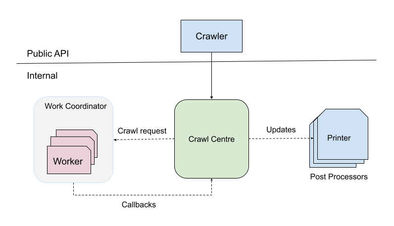
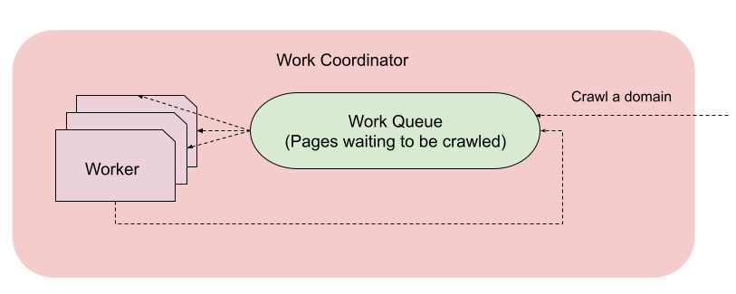

## Problem Statement

Design a web crawler.

Given a starting url, the program should crawl all the pages on that specific domain starting from that url.

## Considerations

Some important considerations while designing this system:

- **Performance**

    - **Latency**:
        - There could be a high volume of web pages even if we apply the domain restriction.
          But crawling one web page is independent of crawling another one. This naturally calls for
          a solution which can crawl multiple web pages in parallel.

          One other reason to have parallelism in the system
          is that a good amount of time of these threads would be spent in network-bound operations (waiting for the
          pages to be downloaded). In that case, it makes to give access of the CPU to other threads.

        - For URLs which can not be crawled, in other words whose content type is not `text/html` such as `pdf`
          or `audio` files, we don't need to download the complete file to determine that. We can just use `HTTP HEAD`
          method here. This could have huge advantage specially for websites that host a lot of static content.
        - Pages could link to each other and there could be a cycle between them. Our program
          should make sure we handle these cases and crawl a web page only once.

- **Correctness**

    - For small websites, we could ensure correctness by unit and manual tests. But for large websites which have
      thousands of links, it'd be good to verify with an external scrapper that our program is scraping correctly. We
      could also set up an alert monitoring for the % of pages for which our system is reporting errors.


- **Testability**

    - This is taken care by careful division of responsibility among different components (see below design) and making
      sure there's no unnecessary coupling between them.
    - Also, I've heavily incorporated dependency injection in my design to make it easy to cover code with unit tests.


- **Extensibility**

    - Currently, we just need to print the web page we are crawling with all the links on it.
      There could be further use cases where we'd want to do something different with those links.
      The design should be extensible enough to accommodate that.


- **Right abstraction levels**

    - An example of how this helps is if we want to switch to a different networking library in the future, it should
      affect only the related modules and not the entire system. Current design with right responsibility division and
      loose coupling ensures this.

### Design

This is how our high level architecture looks like.



Let's deep dive into each component:

### Crawling work

This is how the crawling work looks like:



Let's deep dive into some concepts.

##### Worker

A single unit of work is defined as crawling a single web page and collecting all the child links on that page. These
links are fed to our [worker pool](#workerpool) for further crawling and their processing is completely independent and
asynchronous from their parent page.

An instance of Worker is responsible for this single unit of work.

##### WorkerPool

One of the basic structures that we use in our program is Java's [ThreadPoolExecutor][1]. This comes out of our
performance requirement (See XXX) as we can conveniently tweak the amount of parallelism that we want to have in our
system.

One more advantage is that it comes with a built-in support for using a blocking queue for our tasks which helps us to
decouple the work of crawling the child pages from a parent page. This provides the right level of abstraction to our
application code, specially when designing a publisher-consumer system like this where publishing refers to queueing
more pages to be crawled and consumers crawl one page at a time.

Building upon this, we have a set of independent workers in our system which we call `WorkerPool`. The number of
running workers are capped at a hardcoded number and are dynamically created and destroyed at any point based on the
current requirement of the system.

##### Work Coordinator

Work Coordinator provides public APIs to the other sub systems to request the work execution as we've defined above.

### Post Processors

A post processor is defined as a component which does something with the output of the crawling process. An example
could be printing the results to a file.

Crawl centre takes care of invoking these post processors at the right time with right callbacks. We use **dependency
injection** to provide the set of post processors in our system to the crawl centre. This has a couple of benefits:

- There's no coupling between crawl centre and the processors. Crawl centre doesn't need to know what all processors are
  there and the processors don't care what system is invoking them.
- It's super convenient to add a new post processor. You just need to implement the existing interface and provide the
  implementation to the DI graph.

We use **dagger2** framework for this as compared to guice. This gives us a couple of benefits:

- Performance benefit since the object graph is created at compile time instead of runtime.
- No runtime object graph errors as we get to know them at compile time. So it makes development iteration faster.

### Crawl Centre

This is a critical component that serves as a glue in the entire system, with responsibilities including:

- The only component with which our public API surface interacts
- Requests work coordinator for crawling a domain
- Updates all the post processors with the relevant callbacks.

In current design, we need to take care that this component doesn't get messy with responsibilities being added over
time. But in our current state, it looks good.

### Crawler

This is our Public API surface which offers the simplest API to crawl a domain:

```
/**
 * Starts the crawling process.
 *
 * <p>The process happens asynchronously and this method returns shortly after scheduling it.</p>
 *
 * @param baseUrl the base url to start crawling
 */
void crawl(String baseUrl);
```

This is the only way external consumers can interact with the system.

### Crawling Rules

1. Note that the crawler only supports `HTTP` and `HTTPS` schemes for the starting URL. Same rule is applied when
   crawling further nested pages.

2. On top of #1, we filter URLs with fragments.

3. Currently, we don't limit the depth of how many nested level we go. This could be changed in future iterations to
   handle
   some websites. However, we do make sure that we crawl one page only once.

### Usage

The project has been developed in IntelliJ Idea IDE. The easiest way to run is to just import it in the IDE and
run `Main`.

After we run the program, it asks the user to enter the starting base url on the command line.

Once a valid URL is
entered, the program starts the crawling while printing some useful information on the console while it's going on.

We currently support crawling only 1 domain at a time. The program exits when the crawling finishes.

##### Input format

An absolute url is expected as input, such as `https://monzo.com`.

### Output

The output of each crawling process is stored in a file with naming structure as follows:
`<base-url-authority>-<timestamp-at-start>.txt`. The file is created in project's root directory currently.

For example, when crawling monzo sometime past midnight hours, the
output would be something like: `monzo.com-09 10 2023 02:41:40.txt`.

The format of the output file would look like:

```
Page: https://monzo.com
    Urls on this page:
      https://monzo.com/money-worries/
      https://monzo.com/legal/terms-and-conditions/
      https://monzo.com/i/security/
      ....
      ....
      
Page: https://monzo.com/money-worries/
    Urls on this page:
      ....
      
Error: HTTP error fetching URL. Status=404, URL=[...]

Page: https://monzo.com/legal/terms-and-conditions/
    Urls on this page:
```

As you can observe, the output also includes the errors that we faced while trying to crawl some pages.

### Future Work/Improvements

##### Robustness

Before shipping, the system can be made more robust in the following areas:

1. Crash handling

To make sure we don't crawl a web page twice, we currently maintain an in-memory set. So if the program crashes, we
loose that information. When we restart the program, we just start from scratch. We could improve by reading our
existing file information.

2. Error Handling

The program has not been rigorously tested with a lot of different kind of websites. I believe once we do that, we'd
discover more error cases to handle. For the sake of limited time, I limited by scraped links to http(s) to reduce that
surface.

##### Performance benchmarking

We haven't really done a lot of performance benchmarking right now by tweaking some parameters in our code such as the
amount of parallelism that we want to have.

Memory profiling is also something that I'd want to do here specially since it relates to the number of threads and our
in-memory visited store.

##### More testing coverage

I've added some unit tests but the coverage is not very high right now. On top of that, we need some integration testing
of the whole system with some sample local files as well. Since we are using mockito in our unit tests, it might miss
some cases.

##### More features

Some examples of features that I'd like to add in the application:

- Supporting more public APIs such as ability to stop the current crawling process going on.
- More beautifully printed output

[1]: https://docs.oracle.com/javase/8/docs/api/java/util/concurrent/ThreadPoolExecutor.html

