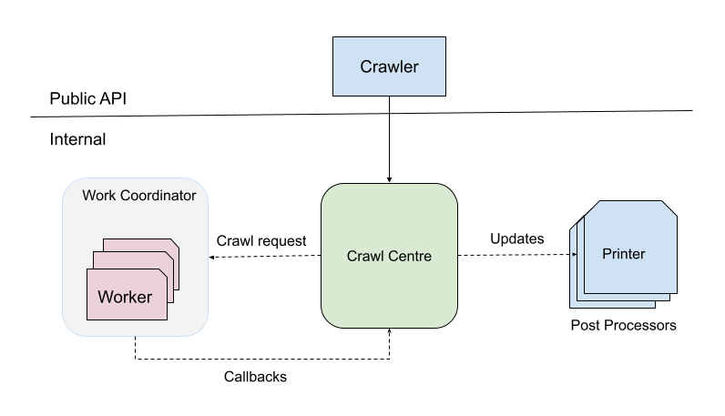
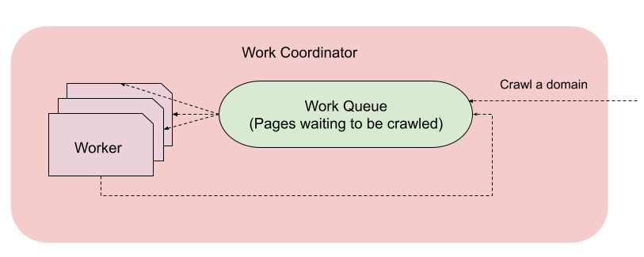

## Problem Statement

Design a web crawler. Given a starting url, the program should crawl all the pages on that specific domain.

## Design

Some important considerations while designing this system:

- **Performance**

    - **Latency**: There could be a high volume of web pages even if we apply the domain restriction.
      But crawling one web page is independent of crawling another one. This naturally calls for
      a solution which can crawl multiple web pages in parallel.
    - **Memory**:
    - **Network**


- **Correctness**

    - Pages could link to each other and there could be a cycle between them. Our program
      should make sure we handle these cases and crawl a web page only once.
    - Handling links with different mime types (pdf etc).


- **Extensibility**

    - Currently, we just need to print the web page we are crawling with all the links on it.
      There could be further use cases where we'd want to do something different with those links.
      The design should be extensible enough to accommodate that.

### Design

This is how our high level architecture looks like.



Let's deep dive into each component:

### Crawling work

This is how the crawling work looks like:



Let's deep dive into some concepts.

##### Worker

A single unit of work is defined as crawling a single web page and collecting all the child links on that page. These
links are fed to our [worker pool](#workerpool) for further crawling and their processing is completely independent and
asynchronous from their parent page.

An instance of Worker is responsible for this single unit of work.

##### WorkerPool

One of the basic structures that we use in our program is Java's [ThreadPoolExecutor][1]. This comes out of our
performance requirement (See XXX) as we can conveniently tweak the amount of parallelism that we want to have in our
system.

One more advantage is that it comes with a built-in support for using a blocking queue for our tasks which helps us to
decouple the work of crawling the child pages from a parent page. This provides the right level of abstraction to our
application code, specially when designing a publisher-consumer system like this where publishing refers to queueing
more pages to be crawled and consumers crawl one page at a time.

Building upon this, we have a set of independent workers in our system which we call `WorkerPool`. The number of
running workers are capped and range from 1 to max at any point based on the current requirement of the system.

##### Work Coordinator

Work Coordinator provides public APIs to the other sub systems to request the work execution as we've defined above.

### Post Processors

A post processor is defined as a component which does something with the output of the crawling process. An example
could be printing the results to a file.

Crawl centre takes care of invoking these post processors at the right time with right callbacks. We use **dependency
injection** to provide the set of post processors in our system to the crawl centre. This has a couple of benefits:

- There's no coupling between crawl centre and the processors. Crawl centre doesn't need to know what all processors are
  there and the processors don't care what system is invoking them.
- It's super convenient to add a new post processor. You just need to implement the existing interface and provide the
  implementation to the DI graph.

We use **dagger2** framework for this. This gives us a couple of benefits:

- Performance benefit since the object graph is created at compile time instead of runtime.
- No runtime object graph errors as we get to know them at compile time. So it makes development iteration faster.

### Crawl Centre

This is a critical component that serves as a glue in the entire system, with responsibilities including:

- The only component with which our public API surface interacts
- Requests work coordinator for crawling a domain
- Updates all the post processors with the relevant callbacks.

In current design, we need to take care that this component doesn't get messy with responsibilities being added over
time. But in our current state, it looks good.

### Crawler

This is our Public API surface which offers the simplest API to crawl a domain:

```
/**
 * Starts the crawling process.
 *
 * <p>The process happens asynchronously and this method returns shortly after scheduling it.</p>
 */
void crawl();
```

This is the only way external consumers can interact with the system.

### Performance

### Quality

Unit tests are the first line of defense against. So the aim is to cover as much code as
possible with unit tests.

### Usage

### Future work

#### Robustness

#### Allow crawling multiple domains 

[1]: https://docs.oracle.com/javase/8/docs/api/java/util/concurrent/ThreadPoolExecutor.html

